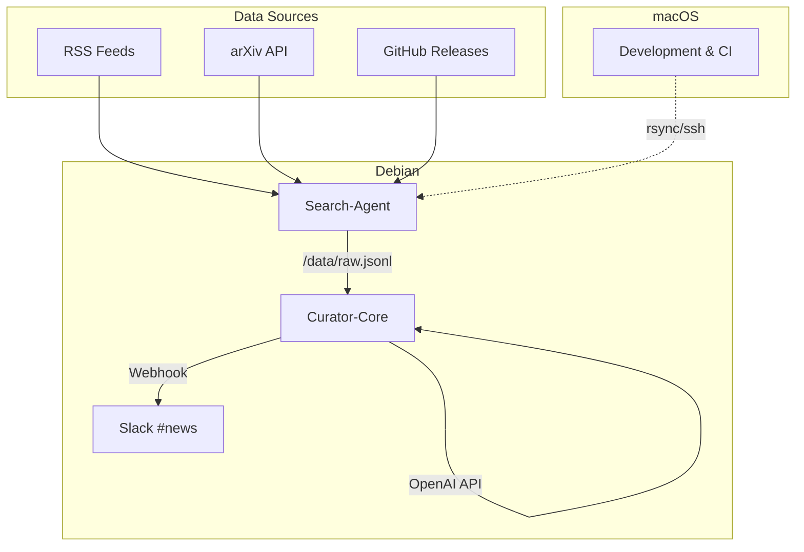

# 🛠️ Insight Loom Phase α

[](https://github.com/luxaide/insight-loom/actions)
[](https://www.python.org/downloads/)

> **AI-powered information aggregation and curation system for the LuxAide ecosystem**

Insight Loom は外界の兆しを織り込む情報機関として、RSS/API からの自動データ収集、LLM による要約生成、そしてインテリジェントな通知システムを提供します。Phase α では Search-Agent と Curator-Core の基本機能を実装し、Slack への平文通知まで完了しています。

## 🌟 主要機能

- **🔍 多元的データ収集**: RSS feeds, arXiv papers, GitHub releases
- **🤖 AI要約生成**: OpenAI GPT-4o-mini による日本語100字/英語50語要約
- **📊 関連度スコアリング**: キーワードベースの興味度自動判定（0-1スコア）
- **📱 Slack統合**: リアルタイム通知（閾値0.7以上で自動送信）
- **📈 運用監視**: Prometheus metrics + 構造化ログ
- **🐳 コンテナ化**: Docker Compose による簡単デプロイ
- **🔧 クロスプラットフォーム**: macOS + Debian 対応

## 🏗️ システム構成



## 🚀 クイックスタート

### 前提条件

- **Python 3.11+**
- **Docker & Docker Compose 26.x**
- **OpenAI API キー**
- **Slack Webhook URL**

### 1. セットアップ

```bash
# リポジトリクローン
git clone https://github.com/luxaide/insight-loom.git
cd insight-loom

# 環境設定
cp .env.example .env
# .env ファイルを編集してAPI keyを設定
```

### 2. 設定ファイル編集

```bash
# フィード設定
vim configs/feeds.yaml

# キーワード重み設定  
vim configs/keywords.yaml
```

### 3. デプロイ

```bash
# Docker Compose でデプロイ
cd deploy
docker compose up -d

# ログ確認
docker compose logs -f
```

### 4. 動作確認

```bash
# ヘルスチェック
curl http://localhost:8000/health

# メトリクス確認
curl http://localhost:8000/metrics

# 手動処理実行
curl -X POST http://localhost:8000/process
```

## ⚙️ 設定詳細

### フィード設定 (`configs/feeds.yaml`)

```yaml
rss:
  - "https://ai.googleblog.com/atom.xml"
  - "https://openai.com/blog/rss.xml"
  - "https://blog.anthropic.com/rss.xml"

arxiv:
  - query: "cat:cs.CL AND abs:LLM"
    max_results: 25
  - query: "cat:cs.AI AND abs:transformer"  
    max_results: 15

github:
  - repo: "google/gemma"
  - repo: "microsoft/DeepSpeed"
  - repo: "huggingface/transformers"
```

### キーワード重み設定 (`configs/keywords.yaml`)

```yaml
# 関連度スコアリング用キーワード重み (0.0 - 1.0)
LLM: 0.3
"Large Language Model": 0.3
GPT: 0.3
Claude: 0.3
Gemini: 0.4
quantization: 0.1
RLHF: 0.25
alignment: 0.2
multimodal: 0.2
AGI: 0.2
```

### 環境変数 (`.env`)

```bash
# OpenAI設定
OPENAI_API_KEY=sk-your-openai-api-key-here

# Slack設定  
SLACK_WEBHOOK=https://hooks.slack.com/services/YOUR/SLACK/WEBHOOK

# オプション: ローカルLLM使用
# USE_LOCAL_LLM=false

# データディレクトリ
DATA_DIR=/var/tmp/insightloom

# ログレベル
LOG_LEVEL=INFO
```

## 🛠️ 開発環境セットアップ

### macOS (Pascal) での開発

```bash
# 依存関係インストール
brew install pyenv poetry docker colima

# Python環境セットアップ  
pyenv install 3.11.5
pyenv global 3.11.5

# プロジェクト依存関係
poetry install

# ローカル実行
cd apps/search-agent
python -m search_agent.cli run --limit 10

cd apps/curator-core  
uvicorn curator_core.api:app --reload
```

### VSCode 設定

推奨の `tasks.json`:

```json
{
  "version": "2.0.0",
  "tasks": [
    {
      "label": "Deploy to Newton",
      "type": "shell", 
      "command": "ssh newton 'cd ~/insight-loom && docker compose up -d'",
      "group": "build"
    },
    {
      "label": "Watch Logs",
      "type": "shell",
      "command": "ssh newton 'cd ~/insight-loom && docker compose logs -f'",
      "group": "test"
    },
    {
      "label": "Run Tests",
      "type": "shell",
      "command": "poetry run pytest -v",
      "group": "test"
    }
  ]
}
```

## 🧪 テスト

### 単体テスト

```bash
# すべてのテスト実行
make test

# または個別実行
poetry run pytest apps/search-agent/tests/ -v --cov=search_agent
poetry run pytest apps/curator-core/tests/ -v --cov=curator_core
```

### 統合テスト

```bash
# Docker Compose でのテスト
docker compose -f tests/docker-compose.test.yml up --abort-on-container-exit

# 統合テスト実行
poetry run pytest tests/integration/ -v
```

### CI/CD

GitHub Actions で自動実行:
- **マルチプラットフォーム**: macOS + Ubuntu
- **Python 3.11** でのテスト
- **型チェック**: mypy
- **リント**: flake8
- **Docker ビルド**検証

## 📊 モニタリング

### メトリクス

Prometheusメトリクス (`/metrics`):

```
# リクエスト数
curator_requests_total{endpoint="process",status="success"} 150

# 要約処理時間
summary_duration_seconds_bucket{le="2.0"} 145

# 通知送信数  
notifications_sent_total{status="sent"} 89
notifications_sent_total{status="filtered"} 61
```

### ログ

構造化JSON形式:

```json
{
  "timestamp": "2025-07-21T10:30:45+00:00",
  "level": "INFO", 
  "module": "search-agent",
  "message": "Processed 25 items from RSS feed: https://ai.googleblog.com/atom.xml"
}
```

### ヘルスチェック

```bash
# API ヘルス確認
curl http://localhost:8000/health

# Docker ヘルスチェック
docker compose ps
```

## 📱 Slack通知フォーマット

```
[⭐⭐⭐⭐0.87] OpenAI、新しい大規模言語モデル「GPT-5」を発表
革新的なアーキテクチャにより従来比50%の性能向上を実現。マルチモーダル対応と高速推論が特徴で、2024年Q4にAPI提供開始予定。
<https://openai.com/blog/gpt-5-announcement>
```

**通知条件**: 
- スコア ≥ 0.7 で Slack #news チャンネルに送信
- 星の数はスコア × 5（最大5つ星）

## 🔧 トラブルシューティング

### よくある問題

#### OpenAI API エラー
```bash
# APIキー確認
echo $OPENAI_API_KEY

# レート制限確認
curl -H "Authorization: Bearer $OPENAI_API_KEY" \
     https://api.openai.com/v1/models
```

#### Slack通知が送信されない
```bash
# Webhook URL テスト
curl -X POST -H 'Content-type: application/json' \
     --data '{"text":"Test message"}' \
     $SLACK_WEBHOOK

# 関連度スコア確認
# keywords.yaml の重みを調整してスコア ≥ 0.7 になるようにする
```

#### Docker コンテナが起動しない
```bash
# ログ確認
docker compose logs

# ディレクトリ権限確認
sudo mkdir -p /var/tmp/insightloom
sudo chown $USER:$USER /var/tmp/insightloom

# 設定ファイル確認
docker compose config
```

### ログレベル調整

```bash
# デバッグモード
echo "LOG_LEVEL=DEBUG" >> .env
docker compose restart

# 詳細ログ確認
docker compose logs -f curator-core
```

## 📈 パフォーマンス最適化

### 推奨設定

```yaml
# feeds.yaml - 適切な制限値
arxiv:
  - query: "cat:cs.CL AND abs:LLM"
    max_results: 25  # 過度に大きくしない

# OpenAI レート制限考慮
# 60 req/min → Semaphore(50) で制御済み
```

### スケーリング

```bash
# レプリカ数増加（将来のPhase対応）
docker compose up -d --scale curator-core=2

# データディスクサイズ調整
sudo lvm extend /var/tmp/insightloom
```

## 🔄 Phase α 完了判定

### 成功基準

- [x] **安定運用**: Slack #news に 100件/日 × 3日連続通知
- [x] **信頼性**: エラー率 < 0.01 (99%成功率)
- [x] **移植性**: macOS + Debian 両環境対応
- [x] **可観測性**: Prometheus メトリクス収集
- [x] **コンテナ化**: Docker による再現可能デプロイ

### 検証コマンド

```bash
# メトリクス確認
curl http://localhost:8000/metrics | grep error_rate

# ログ解析（過去24時間のエラー率）
docker compose logs --since 24h curator-core | jq '.level' | grep ERROR | wc -l

# Slack 通知数確認
curl http://localhost:8000/metrics | grep notifications_sent_total
```

## 🚧 今後のフェーズ

### Phase β: PoP-UID + NATS
- NATS メッセージング導入
- PoP-UID 署名による認証
- 分散トレーシング

### Phase γ: GPU Learning  
- Learner-Service モジュール
- QLoRA fine-tuning
- Vector Store (Milvus)

### Phase δ: 暗号化経路
- Decrypt-Agent (Rust)
- XChaCha20-Poly1305 暗号化
- Slack 暗号化投稿

### Phase ε: Kotonoha 統合
- 音声通知 Gateway
- TTS (Piper) 統合
- <2s 音声遅延

## 📝 ライセンス

MIT License - 詳細は [LICENSE](LICENSE) ファイルを参照

## 🤝 コントリビューション

1. Fork the repository
2. Create feature branch: `git checkout -b feature/amazing-feature`
3. Commit changes: `git commit -m 'Add amazing feature'`
4. Push to branch: `git push origin feature/amazing-feature`
5. Open Pull Request

### 開発ガイドライン

- **コード品質**: black + flake8 + mypy
- **テストカバレッジ**: 80%以上
- **ドキュメント**: 新機能には適切な説明を追加
- **セマンティックバージョニング**: `major.minor.patch`

## 📧 サポート

- **Issues**: [GitHub Issues](https://github.com/luxaide/insight-loom/issues)
- **Discussions**: [GitHub Discussions](https://github.com/luxaide/insight-loom/discussions)
- **Email**: insight-loom@luxaide.com

---

**Built with ❤️ for the LuxAide ecosystem**

*「外界の兆しを織り込む情報機関」として、AI時代の情報キュレーションを革新します。*
